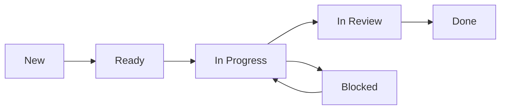

# 🎙️ Meeting Processor

An AI-powered, modular meeting transcription and knowledge management system that transforms your recordings into structured, searchable knowledge in Obsidian with Agile/Scrum task management and intelligent dashboards.

## 🚀 What It Does

**Drop an MP4 → Get Complete Knowledge Management + Agile Task Tracking**

- 🗄️ **Auto-ingests** MP4 recordings from a watched folder
- 🔊 **Converts** to optimized FLAC audio with smart chunking for large files
- 🤖 **Transcribes** with OpenAI Whisper (handles files of any size)
- 🧠 **Analyzes** with Anthropic Claude for summaries, decisions, and action items
- 🎭 **Identifies speakers** and formats conversations naturally
- 🔍 **Detects entities** (people, companies, technologies) with AI context
- 📋 **Extracts ALL tasks** following Agile/Scrum methodology
- 🏗️ **Creates smart notes** in Obsidian with contextual entity relationships
- 📊 **Unified task dashboard** with sprint metrics and team workload
- 🔗 **Builds knowledge graphs** with bi-directional linking between all entities

## ✨ Key Features

### 🏃 Agile/Scrum Task Management
- **Industry-Standard Workflow**: Tasks flow through `new` → `ready` → `in_progress` → `in_review` → `done`
- **YAML Frontmatter**: All tasks use Dataview-compatible frontmatter for powerful queries
- **Sprint Tracking**: Monitor velocity, team workload, and sprint metrics
- **Priority System**: `critical`, `high`, `medium`, `low` with visual indicators
- **Category Classification**: `technical`, `business`, `process`, `documentation`, `research`
- **Blocked Status**: Track impediments and dependencies
- **Unified Dashboard**: Single source of truth for all tasks across meetings

### 🧠 AI-Powered Entity Intelligence
- **Smart Entity Detection**: Automatically identifies people, companies, and technologies mentioned
- **Contextual Understanding**: Uses your company context to determine relationships (colleague vs. client)
- **Rich Entity Profiles**: Creates detailed notes with contact info, project involvement, and meeting history
- **Knowledge Graph Building**: Links people to companies, technologies to projects, meetings to decisions

### 📊 Intelligent Dashboard System
- **Command Center Dashboard**: Main overview of meetings, tasks, people, and business activity
- **Agile Task Board**: Sprint-focused view with status columns and metrics
- **Relationship Analytics**: Track networking patterns and key contact frequency
- **Business Intelligence**: Client engagement metrics and partnership opportunities
- **Velocity Tracking**: Monitor task completion rates and team productivity

### 🏢 Business Context Awareness
- **Company Recognition**: Knows your employer from Obsidian vault context
- **Relationship Mapping**: Automatically categorizes contacts as clients, vendors, colleagues, or prospects
- **Project Tracking**: Links technologies to implementations and business value
- **Decision History**: Tracks technical and business decisions with full context over time

### 🔄 Modern Modular Architecture
- **Clean Separation**: Refactored into focused, maintainable components
- **Dashboard Orchestration**: Intelligent dashboard generation with multiple specialized analyzers
- **Task Processing Pipeline**: Dedicated task extraction, creation, and linking system
- **Entity Management**: Sophisticated AI-powered entity detection and relationship building
- **Robust Error Handling**: Graceful degradation and comprehensive logging

## 📋 Prerequisites

- Docker & Docker Compose installed
- API Keys for:
  - [OpenAI Platform](https://platform.openai.com/) (for Whisper transcription)
  - [Anthropic Console](https://console.anthropic.com/) (for Claude analysis)
- Obsidian Vault with [Dataview plugin](https://github.com/blacksmithgu/obsidian-dataview) installed

## 🛠️ Quick Start

### 1. Clone & Setup
```bash
git clone https://github.com/YourUser/meeting-processor.git
cd meeting-processor
cp .env.sample .env
```

### 2. Configure Environment
Edit `.env` with your settings:
```env
# API Keys (Required)
OPENAI_API_KEY=sk-...
ANTHROPIC_API_KEY=sk-...

# Obsidian Integration
OBSIDIAN_VAULT_PATH=C:/Obsidian_Vaults/My_Vault
OBSIDIAN_FOLDER_PATH=Meetings

# Docker Paths
INPUT_DIR=/app/input
OUTPUT_DIR=/app/output
PROCESSED_DIR=/app/processed

# Testing & Development
TESTING_MODE=true
```

### 3. Build & Run
```bash
# Using the enhanced PowerShell script
.\rebuild.ps1 rebuild

# Or traditional Docker Compose
docker-compose up --build -d
```

### 4. Setup Your Company Context
Create a company note in Obsidian at `/Companies/Your-Company.md`:
```markdown
# Your Company Name

**Current Employer:** Yes

## Company Information
Industry: Your Industry
Location: Your Location
```

### 5. Install Obsidian Templates
Copy the provided templates to your vault:
- `task-template.md` → `/Templates/task-template.md`
- `Task-Dashboard.md` → `/Meta/dashboards/Task-Dashboard.md`

## 📂 Modern Refactored Architecture

```
meeting-processor/
├── main.py                    # Application orchestrator
├── config/                    # Configuration management
│   └── settings.py           # Environment & API setup + Agile constants
├── core/                     # Core processing pipeline
│   ├── audio_processor.py    # MP4→FLAC conversion & chunking
│   ├── transcription.py      # OpenAI Whisper integration  
│   ├── claude_analyzer.py    # AI analysis & speaker ID
│   ├── file_manager.py       # File operations & tracking
│   ├── task_extractor.py     # Agile/Scrum task extraction
│   ├── content_parser.py     # Text parsing utilities
│   ├── vault_analyzer.py     # Data analysis from vault
│   ├── insights_generator.py # AI insights & trends
│   ├── dashboard_builder.py  # Dashboard content formatting
│   └── dashboard_orchestrator.py # Dashboard coordination
├── entities/                 # Smart entity management
│   ├── detector.py          # AI entity detection
│   ├── manager.py           # Obsidian note creation
│   └── ai_context.py        # Context extraction
├── obsidian/                # Obsidian integration
│   └── formatter.py         # Note templates & formatting
├── monitoring/              # File system monitoring
│   └── file_watcher.py      # MP4 detection & processing
└── utils/                   # Shared utilities
    └── logger.py            # Enhanced logging
```

## 🎯 Complete Workflow Example

### 1. Drop Recording
```
input/client-strategy-meeting.mp4
```

### 2. AI Processing Pipeline
```
🎵 Converting to FLAC...
🎤 Transcribing with Whisper...
🧠 Analyzing with Claude...
🔍 Detecting entities: Madison, PSA, Salesforce, Lambda
📋 Extracting 7 tasks from meeting...
🏗️ Creating entity notes with AI context...
📝 Generating meeting note with task links...
🧠 Updating command center dashboard...
✅ Complete!
```

### 3. Generated Knowledge System
```
📅 Meeting Note: Client-Strategy-Call_2025-06-20_14-30_meeting.md
👤 Person Note: People/Madison.md (role, company, relationship)
🏢 Company Note: Companies/PSA.md (business needs, relationship status)
💻 Technology Note: Technologies/Salesforce.md (implementation details)
📋 Task Records: 7 individual task files with Agile status tracking
📊 Unified Dashboard: Task-Dashboard.md with sprint metrics
🧠 Command Center: Updated with latest intelligence
```

### 4. Obsidian Integration Features
- **Bi-directional Linking**: All notes cross-reference each other
- **Task Traceability**: Click from dashboard → task → meeting → entities
- **Knowledge Graph**: Visual connections between all concepts
- **Dataview Queries**: Dynamic task boards and analytics
- **YAML Frontmatter**: Structured data for powerful queries

## 📋 Agile Task Management

### Task Lifecycle


### Task Structure (YAML Frontmatter)
```yaml
---
status: new
priority: high
category: technical
assigned_to: Madison
due_date: 2025-06-23
meeting_source: Client-Strategy-Call_2025-06-20_14-30_meeting
sprint: Sprint-24
story_points: 3
---
```

### Sprint Metrics Dashboard
- **Current Sprint Status**: Tasks by status
- **Team Workload**: Active tasks per person
- **Velocity Tracking**: Completion rates over time
- **Priority Distribution**: Critical vs high vs medium vs low
- **Overdue Alerts**: Tasks past their due date

## 📊 Unified Task Dashboard

The system uses a single, powerful Task-Dashboard that provides:

### Board Views
- **🆕 New**: Unprocessed tasks from meetings
- **📋 Ready**: Refined backlog ready for work
- **🚀 In Progress**: Active development
- **🔍 In Review**: Testing and approval
- **🚫 Blocked**: Impediments to resolve
- **✅ Done**: Recently completed

### Analytics
- **Sprint Metrics**: Status distribution and velocity
- **Team Performance**: Individual workload and completion rates
- **Priority Analysis**: Task urgency distribution
- **Meeting Impact**: Tasks generated per meeting

### Alerts
- **🔥 Overdue Tasks**: Past deadline
- **🚨 Critical Priority**: Urgent items needing attention
- **🔓 Unassigned High Priority**: Important tasks without owners

## 🔧 Management Commands

```bash
# Quick restart after code changes
.\rebuild.ps1 restart

# Full rebuild after dependency changes  
.\rebuild.ps1 rebuild

# View live logs
.\rebuild.ps1 logs

# Check container status
.\rebuild.ps1 status

# Clean rebuild (if Docker issues)
.\rebuild.ps1 clean
```

## 🌟 Entity Intelligence Examples

### Smart Person Detection
```markdown
# Madison
**Relationship to NeuraFlash:** Colleague
**Role:** Senior Developer  
**Department:** Engineering
**Projects Involved:** PSA Salesforce Implementation
**Meeting History:**
- [[Client-Strategy-Call_2025-06-20]] - 2 days ago
```

### Contextual Company Notes
```markdown
# PSA
**Relationship to NeuraFlash:** Client
**Business Needs:** Salesforce automation, payroll integration
**Technologies Used:** Salesforce, AWS Lambda
**Contract Status:** Active Implementation
**Key Contacts:** Madison (Developer), John (Project Manager)
```

### Technical Documentation
```markdown
# AWS Lambda
**Current Status:** Deployed
**Owner/Responsible:** Engineering Team
**Use Cases:** Salesforce automation, data processing
**Business Value:** Reduced manual processing by 80%
**Implementation Status:** Production Ready
```

## 📋 Task Record Example (Agile Format)

```markdown
---
status: new
priority: high
category: technical
assigned_to: Madison
due_date: 2025-06-23
meeting_source: Client-Strategy-Call_2025-06-20_14-30_meeting
---

# 🔥 💻 Fix prompt to say 'star' or 'asterisk' correctly

## Task Details
**Status:** 🆕 New  
**Priority:** 🔥 High  
**Category:** 💻 Technical  
**Assigned To:** Madison  
**Due Date:** 📅 2025-06-23 🔥 URGENT  

## Description
Fix the IVR prompt to correctly say "star" or "asterisk" when instructing users

## Progress Tracking
- [ ] Task understood and scoped
- [ ] Dependencies identified and resolved
- [ ] Work in progress
- [ ] Ready for review
- [ ] Completed

## Work Log
### 2025-06-20 - Created
- Status: `new`
- Extracted from meeting transcript
- Assigned to Madison based on technical expertise
```

## 🏢 Business Intelligence Features

- **Client Relationship Tracking**: Automatically categorizes contacts and companies
- **Project Documentation**: Links technologies to implementations and outcomes  
- **Decision History**: Tracks technical and business decisions with full context
- **Knowledge Discovery**: Find patterns across meetings and relationships
- **Expertise Mapping**: Identify who knows what technologies and clients
- **Productivity Analytics**: Sprint velocity, task completion, and workload patterns

## 🔍 Advanced Configuration

### Custom Task Priorities
```python
# In settings.py
TASK_PRIORITIES = ['critical', 'high', 'medium', 'low']
PRIORITY_EMOJIS = {
    'critical': '🚨',
    'high': '🔥',
    'medium': '⚡',
    'low': '📌'
}
```

### Custom Categories
```python
# Add your domain-specific categories
TASK_CATEGORIES = ['technical', 'business', 'process', 'documentation', 'research', 'your-custom-category']
```

### Sprint Configuration
Extend task template to include sprint planning fields:
- Sprint number
- Story points
- Epic linkage
- Acceptance criteria

## 📊 Monitoring & Analytics

- **Processing Statistics**: Track entity detection accuracy and processing times
- **Knowledge Growth**: Monitor vault expansion and relationship building
- **Sprint Health**: Velocity trends and completion rates
- **Team Performance**: Individual and team productivity metrics
- **Meeting ROI**: Tasks and decisions generated per meeting hour
- **Dashboard Intelligence**: AI-powered insights about work patterns

## 🤝 Contributing

This is a modular, extensible system designed for enhancement:

1. Fork the repository
2. Create a feature branch  
3. Add your enhancement to the appropriate module
4. Test with your meeting recordings
5. Submit a PR with clear documentation

### Extension Ideas
- Jira/Azure DevOps integration for task sync
- Sprint planning automation
- Burndown chart generation
- Slack notifications for task assignments
- Time tracking integration
- Custom workflow states
- AI-powered task estimation
- Automated task prioritization

## 📜 License

MIT License - Use, modify, and redistribute freely with attribution.

## 🎯 Perfect For

- **Agile Teams**: Sprint planning, backlog grooming, and velocity tracking
- **Consulting Firms**: Client task management and project documentation
- **Software Teams**: Technical debt tracking and sprint retrospectives
- **Product Managers**: Feature request extraction and prioritization
- **Project Managers**: Comprehensive task tracking and team coordination
- **Any Business**: Building institutional knowledge with actionable task management

---

**Transform your meetings into structured knowledge with AI-powered intelligence and Agile/Scrum task management.**

Built with ❤️ for teams who value efficient meetings and need reliable task tracking.

*Latest Update: Full Agile/Scrum task management with unified dashboard, YAML frontmatter support, and sprint metrics.*