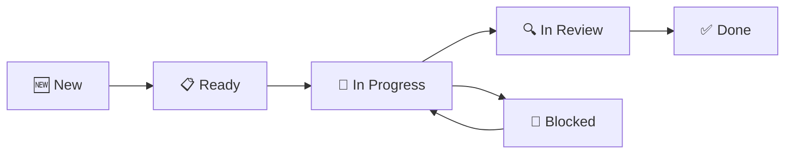

# Task Management Dashboard

> *Agile/Scrum task board powered by [Dataview](https://github.com/blacksmithgu/obsidian-dataview)*

---

## 🆕 New (Unprocessed)
*Tasks that have been captured but not yet refined or assigned*

```dataview
TABLE WITHOUT ID
  file.link as Task,
  priority as Priority,
  category as Category,
  due_date as "Due Date",
  assigned_to as "Assigned To"
FROM "Tasks"
WHERE status = "new"
SORT 
  choice(priority = "critical", 1, priority = "high", 2, priority = "medium", 3, priority = "low", 4) ASC,
  due_date ASC
```

---

## 📋 Ready (Backlog)
*Refined tasks ready to be picked up for work*

```dataview
TABLE WITHOUT ID
  file.link as Task,
  priority as Priority,
  category as Category,
  due_date as "Due Date",
  assigned_to as "Assigned To"
FROM "Tasks"
WHERE status = "ready"
SORT 
  choice(priority = "critical", 1, priority = "high", 2, priority = "medium", 3, priority = "low", 4) ASC,
  due_date ASC
```

---

## 🚀 In Progress
*Tasks currently being worked on*

```dataview
TABLE WITHOUT ID
  file.link as Task,
  priority as Priority,
  category as Category,
  due_date as "Due Date",
  assigned_to as "Assigned To"
FROM "Tasks"
WHERE status = "in_progress"
SORT assigned_to ASC, priority DESC
```

---

## 🔍 In Review
*Tasks in code review, testing, or approval*

```dataview
TABLE WITHOUT ID
  file.link as Task,
  priority as Priority,
  category as Category,
  due_date as "Due Date",
  assigned_to as "Assigned To"
FROM "Tasks"
WHERE status = "in_review"
SORT 
  choice(priority = "critical", 1, priority = "high", 2, priority = "medium", 3, priority = "low", 4) ASC,
  due_date ASC
```

---

## 🚫 Blocked
*Tasks with impediments that need resolution*

```dataview
TABLE WITHOUT ID
  file.link as Task,
  priority as Priority,
  category as Category,
  due_date as "Due Date",
  assigned_to as "Assigned To"
FROM "Tasks"
WHERE status = "blocked"
SORT 
  choice(priority = "critical", 1, priority = "high", 2, priority = "medium", 3, priority = "low", 4) ASC
```

---

## ✅ Done (Recent)
*Completed tasks from the last 30 days*

```dataview
TABLE WITHOUT ID
  file.link as Task,
  priority as Priority,
  category as Category,
  assigned_to as "Completed By",
  file.mtime as "Completed"
FROM "Tasks"
WHERE status = "done" AND file.mtime >= date(today) - dur(30 days)
SORT file.mtime DESC
LIMIT 20
```

---

## 📊 Sprint Metrics

### Current Sprint Status
```dataview
TABLE WITHOUT ID
  status as Status,
  length(rows) as Count
FROM "Tasks"
WHERE status != "done" AND status != "cancelled"
GROUP BY status
```

### By Priority
```dataview
TABLE WITHOUT ID
  choice(priority = "critical", "🚨 Critical", priority = "high", "🔥 High", priority = "medium", "⚡ Medium", priority = "low", "📌 Low", "❓ Unknown") as Priority,
  length(rows) as Count
FROM "Tasks"
WHERE status != "done" AND status != "cancelled"
GROUP BY priority
SORT choice(priority = "critical", 1, priority = "high", 2, priority = "medium", 3, priority = "low", 4) ASC
```

### By Category
```dataview
TABLE WITHOUT ID
  category as Category,
  length(rows) as Count
FROM "Tasks"
WHERE status != "done" AND status != "cancelled"
GROUP BY category
```

### Team Workload
```dataview
TABLE WITHOUT ID
  assigned_to as "Team Member",
  length(rows) as "Active Tasks"
FROM "Tasks"
WHERE (status = "in_progress" OR status = "in_review") AND assigned_to != "" AND assigned_to != null
GROUP BY assigned_to
SORT length(rows) DESC
```

---

## ⚠️ Attention Required

### 🔥 Overdue Tasks
```dataview
TABLE WITHOUT ID
  file.link as Task,
  priority as Priority,
  assigned_to as "Assigned To",
  due_date as "Due Date"
FROM "Tasks"
WHERE due_date < date(today) AND status != "done" AND status != "cancelled" AND due_date != "" AND due_date != null
SORT due_date ASC
```

### 🚨 Critical Priority
```dataview
TABLE WITHOUT ID
  file.link as Task,
  status as Status,
  due_date as "Due Date",
  assigned_to as "Assigned To"
FROM "Tasks"
WHERE priority = "critical" AND status != "done" AND status != "cancelled"
SORT status ASC, due_date ASC
```

### 🔓 Unassigned High Priority
```dataview
TABLE WITHOUT ID
  file.link as Task,
  category as Category,
  due_date as "Due Date"
FROM "Tasks"
WHERE (assigned_to = "" OR assigned_to = null) AND priority = "high" AND status != "done" AND status != "cancelled"
SORT due_date ASC
```

---

## 📈 Velocity Tracking

### Tasks Completed This Week
```dataview
TABLE WITHOUT ID
  file.link as Task,
  assigned_to as "Completed By",
  priority as Priority
FROM "Tasks"
WHERE status = "done" AND file.mtime >= date(today) - dur(7 days)
SORT file.mtime DESC
```

### Tasks by Meeting Source (Last 30 Days)
```dataview
TABLE WITHOUT ID
  meeting_source as "Meeting",
  length(rows) as "Tasks Generated"
FROM "Tasks"
WHERE meeting_date >= date(today) - dur(30 days) AND meeting_source != "" AND meeting_source != null
GROUP BY meeting_source
SORT length(rows) DESC
LIMIT 10
```

---

## 🔧 Quick Actions

- **Create New Task:** [[Templates/task-template|📝 New Task]]
- **View All Tasks:** [[Tasks/|📁 Tasks Folder]]
- **Meeting Notes:** [[Meetings/|📅 All Meetings]]
- **Command Center:** [[Meta/dashboards/🧠-Command-Center|🧠 Main Dashboard]]

---

## 📋 Task Management Guide

### Status Workflow


### Priority Levels
- 🚨 **Critical** - Drop everything
- 🔥 **High** - Top priority
- ⚡ **Medium** - Normal priority
- 📌 **Low** - When time permits

---

*Dashboard refreshes automatically when task properties change*  
*Last updated: This dashboard updates in real-time via Dataview*